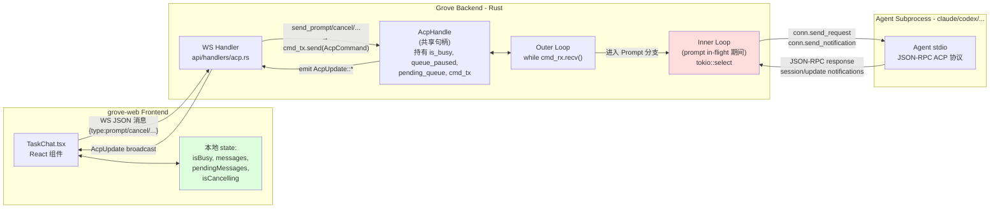
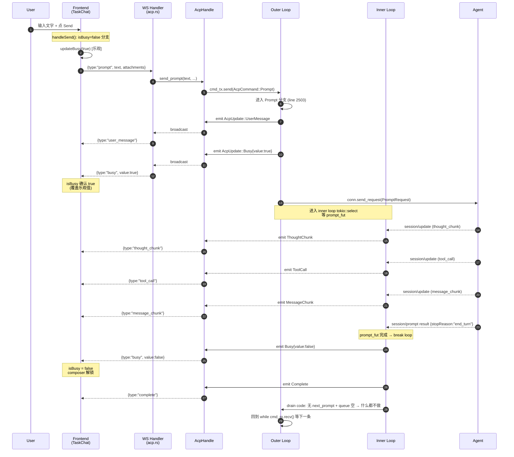
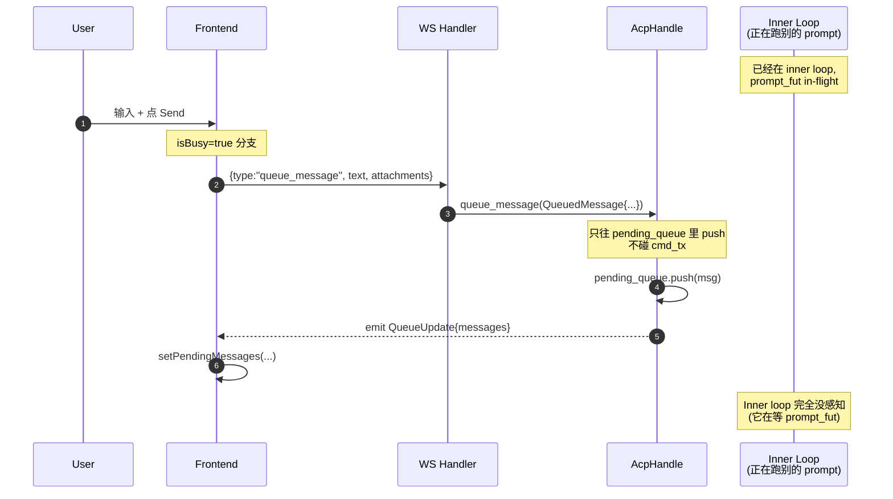
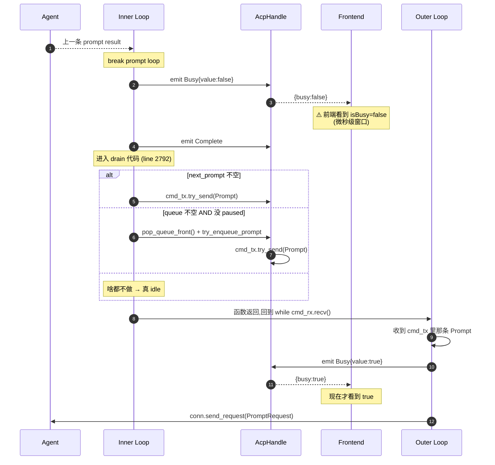
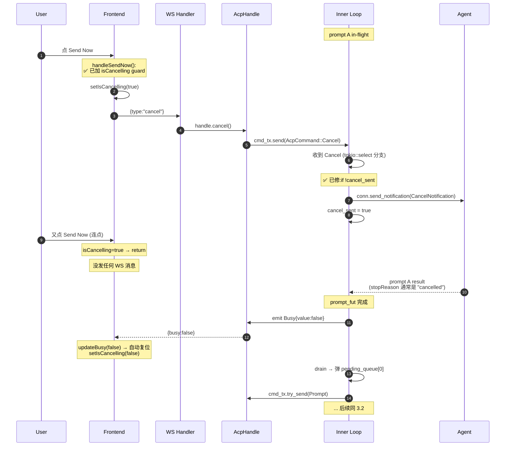
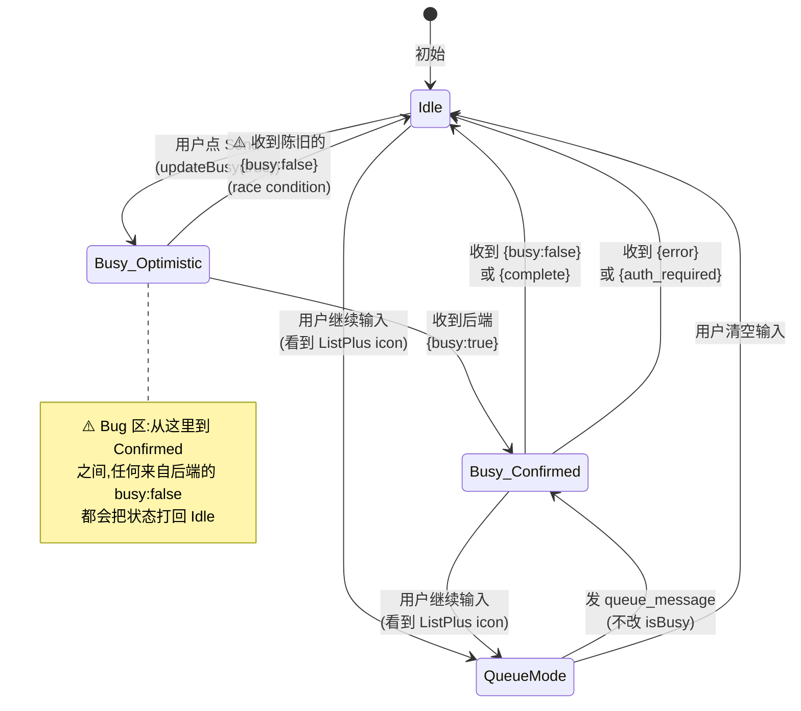

# ACP 聊天状态机梳理

本文梳理 Grove 当前 ACP 聊天的完整数据流、状态机和已知问题。代码位置以文件:行号标注。

---

## 一、整体架构



### 关键概念

- **AcpHandle**: 进程内 `Arc<...>`,所有 WS 连接共享同一个 handle(同一个 chat 可以多客户端连接)
- **cmd_tx / cmd_rx**: mpsc channel,WS handler 通过它把 `AcpCommand`(Prompt/Cancel/SetMode/...)推给 cmd loop
- **AcpUpdate**: 通过 broadcast channel 反向推给所有 WS 连接(Busy/Complete/MessageChunk/QueueUpdate/...)
- **Inner Loop 是关键**: 进入 in-flight prompt 后,**所有 cmd 都被 inner loop 的 select 截获**,外层 loop 看不到。这是很多 bug 的根源

---

## 二、Happy Path:发一条消息的完整时序



**这条 happy path 没问题**。问题都在偏离这条路径时发生。

---

## 三、Pending Queue 生命周期

### 3.1 queue_message 入队(用户在 agent busy 时发消息)



### 3.2 自动 drain(prompt 完成 → 弹一条出来)



**这里就是"发完没反应"的根源** — 步骤 3 到 13 之间的窗口,前端 `isBusy=false`,用户输入 + 点 send 就走 `"prompt"` 类型(不是 queue_message)。

---

## 四、Cancel / Send Now 流程



**修完后这条路径是干净的**。剩余问题:

1. 用户以为 Send Now = "把那条 pending 立刻发出去",实际是 "cancel 当前 + 让队列下一条上"。两个语义点击时分不出来
2. drain 出来的 prompt 跟 cancel 不是原子的 — 如果 agent 那边不及时回 cancel ack,整个 chat 就卡住等

---

## 五、Frontend isBusy 状态机



### 已知 bug 点

- `Busy_Optimistic → Idle` 这条迁移是 race condition 引起的伪状态。前端没办法分辨 "这个 busy:false 是给我刚发的 prompt 的" vs "是上一个 turn 残留的"
- 多 WS tab 时,A tab 看到的 busy:false 也会推给 B tab(同 chat),可能制造意外迁移

---

## 六、Backend Cmd Loop 状态机

```mermaid
stateDiagram-v2
    [*] --> WaitingForCmd: 启动

    WaitingForCmd --> ProcessingPrompt: AcpCommand::Prompt<br/>(进入 inner loop)
    WaitingForCmd --> ProcessingSetMode: SetMode<br/>(block_task().await)
    WaitingForCmd --> ProcessingSetModel: SetModel
    WaitingForCmd --> WaitingForCmd: Cancel<br/>(idle 时忽略)
    WaitingForCmd --> [*]: Kill

    ProcessingPrompt --> ProcessingPrompt: 收到 Cancel<br/>(✅ 已修:dedup)
    ProcessingPrompt --> ProcessingPrompt: 收到 Prompt<br/>(✅ 已修:dedup cancel +<br/>store as next_prompt)
    ProcessingPrompt --> ProcessingSetMode_InTurn: SetMode<br/>⚠️ 阻塞 inner loop
    ProcessingPrompt --> [*]: Kill (内部)
    ProcessingPrompt --> Drain: prompt_fut 完成

    ProcessingSetMode_InTurn --> ProcessingPrompt: SetMode response 回来

    Drain --> ProcessingPrompt: 有 next_prompt<br/>或 pending_queue 非空
    Drain --> WaitingForCmd: 全空,真 idle

    ProcessingSetMode --> WaitingForCmd
    ProcessingSetModel --> WaitingForCmd

    note right of ProcessingSetMode_InTurn
        ⚠️ Bug:这一刻 inner loop 卡死
        不能 poll prompt_fut
        不能接 cancel
        agent 在等响应也等不到
    end note

    note right of Drain
        ⚠️ Bug:Busy=false 在这一步
        emit,然后才转到 ProcessingPrompt
        emit Busy=true。中间窗口前端
        看到伪 idle
    end note
```

---

## 七、问题汇总与对应位置

| # | 问题 | 位置 | 状态 |
|---|---|---|---|
| 1 | Cancel 不去重,无限延长 10s 强杀 | `mod.rs:2569` | ✅ 已修 |
| 2 | 10s 强杀超时导致 receiver dropped | `mod.rs:2563` | ✅ 已删 |
| 3 | resume_queue 无条件 eager pop | `mod.rs:3691` | ✅ 已修(加 is_busy 判断) |
| 4 | Send Now 连点产生 cancel 风暴 | `TaskChat.tsx` Send Now 按钮 | ✅ 已修(isCancelling guard) |
| **5** | **Drain 切换时 Busy=false 先 emit,前端看到伪 idle 窗口** | `mod.rs:2715 / 2755 / 2792` | **未修** |
| **6** | **网络竞争:前端乐观 updateBusy(true) 被陈旧的后端 Busy=false 覆盖** | `TaskChat.tsx:3153` | **未修** |
| **7** | **SetMode/SetModel/SetThoughtLevel 在 inner loop 里 block_task().await,卡死整个 cmd 处理** | `mod.rs:2581 / 2603 / 2620` | **未修** |
| **8** | **session/prompt 没有任何超时**(用户已选不加) | `mod.rs:2559` | (用户已决) |
| **9** | **Send Now 图标和语义脱钩**(已通过 #4 间接缓解) | UI | 已通过 #4 间接缓解 |
| **10** | **重复文本 prompt**(同文本不同 id 发两遍) | 未定位 | **未修**,理论解释为用户在 #5/#6 desync 窗口里手动重发 |
| **11** | **多 WS tab 互相干扰**(同 chat 的 busy/queue update 跨 tab 推送) | 设计层面 | **未确认** |

---

## 八、核心结论

**整个 ACP 状态机的最大设计弱点**: `isBusy` 这个 boolean 被多个事件源驱动 — 前端乐观、后端 Busy=true、后端 Busy=false、后端 Complete、后端 Error/AuthRequired,**没有一个权威的 "current request id" 作为状态归属的锚点**。

类比:像 TCP 但没有 sequence number。

### 根治方向

如果要根治,应该:

- 给每次 prompt 一个 `request_id`(后端生成)
- 前端 `isBusy = currentRequestId !== null`,不再是 boolean
- 后端的所有 Busy/Complete/Error 事件都带 request_id
- 前端忽略 request_id 不匹配的状态事件

这是协议层级的改动,**目前所有的修法都是在缓解症状**,真要稳就得做这个。
