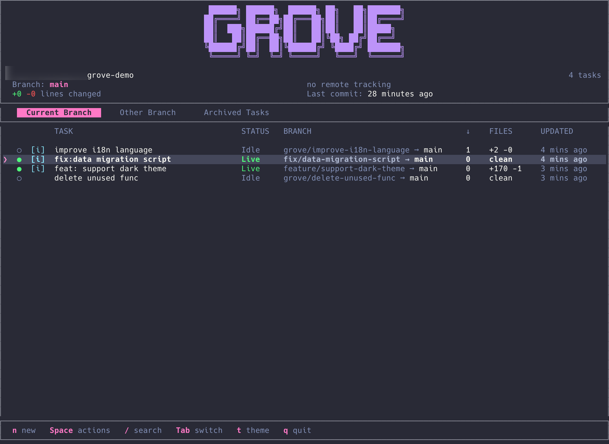

# Grove

**Run 10 AI agents. Zero context switching.**

[](https://crates.io/crates/grove-rs)
[](https://crates.io/crates/grove-rs)
[](https://www.rust-lang.org/)
[](LICENSE)
[]()


Manage multiple AI coding tasks in parallel. Each task gets its own Git worktree and tmux session—isolated, organized, always ready to resume.

---

## The Problem

You're juggling Claude Code on feature A, Cursor fixing bug B, and reviewing PR C.

With traditional Git, this means:
- Constant `git stash` / `git stash pop` gymnastics
- Branch switching that kills your terminal state
- "Wait, what was I working on?" moments
- AI agents losing context mid-task

**Your workflow shouldn't fight your tools.**

## The Solution

Grove gives each task its own **isolated universe**:



- Switch between tasks **instantly** — no stashing, no rebuilding
- Resume exactly where you left off — terminal state preserved
- Let AI agents run in parallel without stepping on each other

---

## Features

🎯 **Task Dashboard** — See all tasks at a glance with live status

🔀 **True Isolation** — Each task = own branch + worktree + terminal

💾 **Session Persistence** — Close Grove, reopen tomorrow, everything's still there

⚡ **One-Key Actions** — Create, switch, sync, merge, archive with single keystrokes

🔔 **Agent Hooks** — Get notified when AI finishes (sound + system notification)

🎨 **8 Themes** — Dracula, Nord, Gruvbox, Tokyo Night, Catppuccin, and more

---

## Quick Start

**Install:**
```bash
curl -sSL https://raw.githubusercontent.com/GarrickZ2/grove/master/install.sh | sh
# or
cargo install grove-rs
```

**Run:**
```bash
cd your-project && grove
```

**Create your first task:** Press `n`, name it, start coding.

## Keyboard Shortcuts

| Key | Action |
|-----|--------|
| `n` | New task |
| `Enter` | Open task in tmux |
| `Space` | Action menu |
| `j/k` | Navigate |
| `Tab` | Switch tabs |
| `/` | Search |
| `t` | Change theme |
| `?` | Help |
| `q` | Quit |

## Agent Hooks

Let Grove watch your AI agents so you don't have to.

When Claude/Cursor/Copilot finishes a task, trigger notifications:

```bash
grove hooks notice    # Task completed
grove hooks warn      # Needs attention
grove hooks critical  # Something's wrong
```

Press `h` in Grove to configure sound and notification settings.

---

## Requirements

- Git 2.20+
- tmux 3.0+
- macOS 12+ or Linux

## License

MIT
