# Grove

**Run 10 AI agents. Zero context switching.**

[](https://garrickz2.github.io/grove/)
[](https://crates.io/crates/grove-rs)
[](https://crates.io/crates/grove-rs)
[](https://www.rust-lang.org/)
[](LICENSE)
[]()

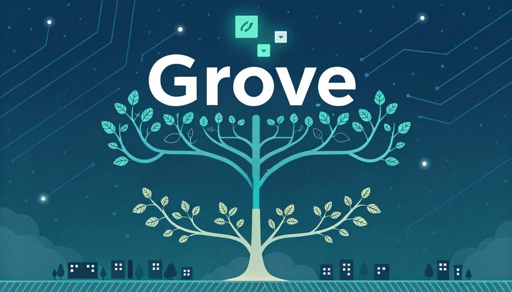

Manage multiple AI coding tasks in parallel. Each task gets its own Git worktree and tmux/Zellij session—isolated, organized, always ready to resume.

**Works with:** Claude Code · Cursor · GitHub Copilot · CodeX · Trae · Gemini · Amazon Q · Qwen · Kimi · any AI agent

---

## The Problem

You're juggling Claude Code on feature A, Cursor fixing bug B, and reviewing PR C.

With traditional Git, this means:
- Constant `git stash` / `git stash pop` gymnastics
- Branch switching that kills your terminal state
- "Wait, what was I working on?" moments
- AI agents losing context mid-task

**Your workflow shouldn't fight your tools.**

## The Solution

Grove gives each task its own **isolated universe**:

- Switch between tasks **instantly** — no stashing, no rebuilding
- Resume exactly where you left off — terminal state preserved
- Let AI agents run in parallel without stepping on each other

<p align="center">
  
</p>

---

## Features

**Three Interfaces** — TUI for keyboard warriors, Web UI for visual workflows, native GUI for macOS

**Task Dashboard** — See all tasks at a glance with live status

**True Isolation** — Each task = own branch + worktree + terminal

**Session Persistence** — Close Grove, reopen tomorrow, everything's still there

**One-Key Actions** — Create, switch, sync, merge, archive with single keystrokes

**Agent Hooks** — Get notified when AI finishes (sound + system notification)

**MCP Server** — Model Context Protocol integration for AI agents (Claude Code, etc.)

**Preview Panel** — Side panel with Git info, code review, and notes per task

**11 Themes** — Dracula, Nord, Gruvbox, Tokyo Night, Catppuccin, and more


---

## Quick Start

**Install:**
```bash
curl -sSL https://raw.githubusercontent.com/GarrickZ2/grove/master/install.sh | sh
# or
cargo install grove-rs
```

**Run TUI:**
```bash
cd your-project && grove
```

**Run Web UI:**
```bash
grove web              # Open http://localhost:3001
grove web --port 8080  # Custom port
```

**Run GUI (macOS):**
```bash
grove gui              # Launch native desktop window
grove gui --port 8080  # Custom API port
```

**Create your first task:** Press `n` in TUI, or click "New Task" in Web/GUI.

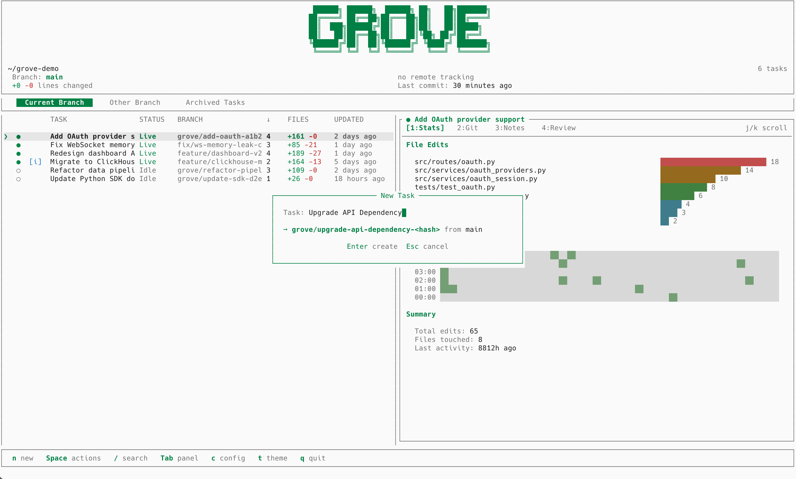

---

## Three Interfaces

### TUI — `grove`

A full-featured terminal interface built with Ratatui. Navigate tasks, preview Git diffs, read review comments, and manage your entire workflow without leaving the terminal.

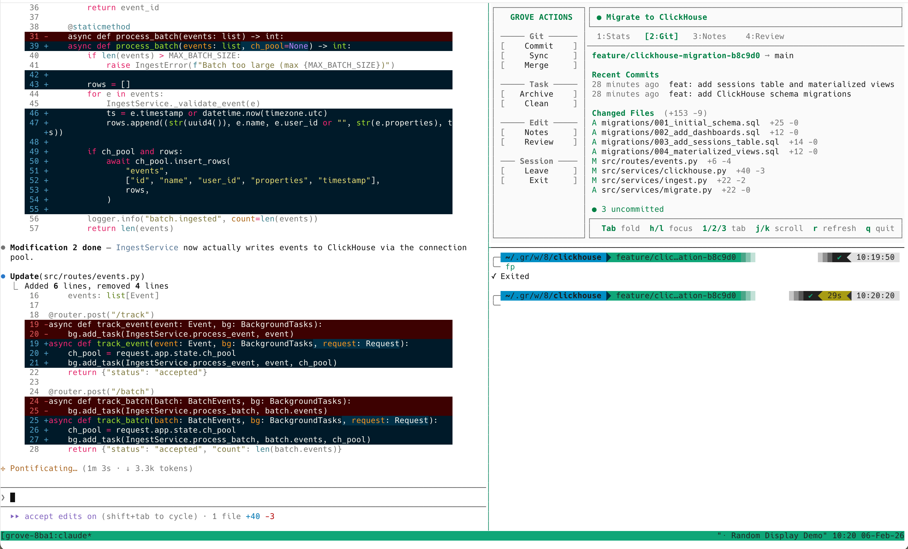

| Key | Action |
|-----|--------|
| `n` | New task |
| `Enter` | Open task in tmux/Zellij |
| `Space` | Action menu |
| `j/k` | Navigate |
| `Tab` | Switch tabs |
| `/` | Search |
| `p` | Toggle preview panel |
| `t` | Change theme |
| `?` | Help |
| `q` | Quit |

### Web UI — `grove web`

A full-featured web interface embedded directly in the binary — no separate frontend deployment needed. Two modes: **Zen** (single-project focus) and **Blitz** (cross-project active task aggregation with notification-aware sorting).

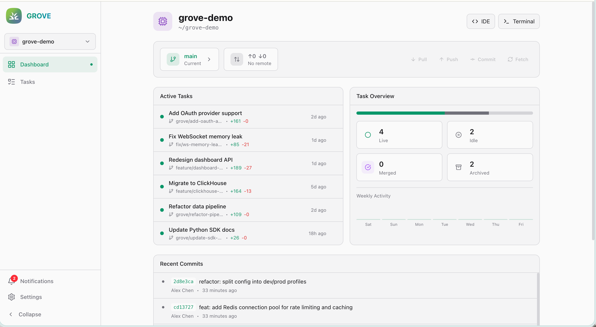

| | |
|---|---|
| 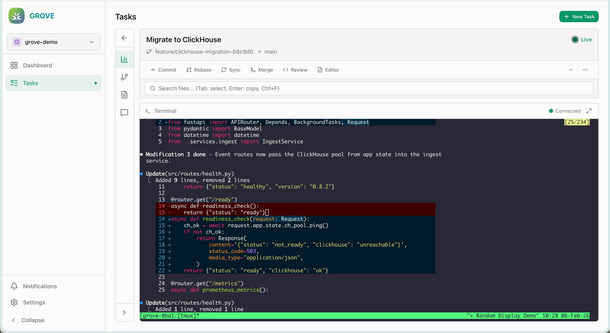 | 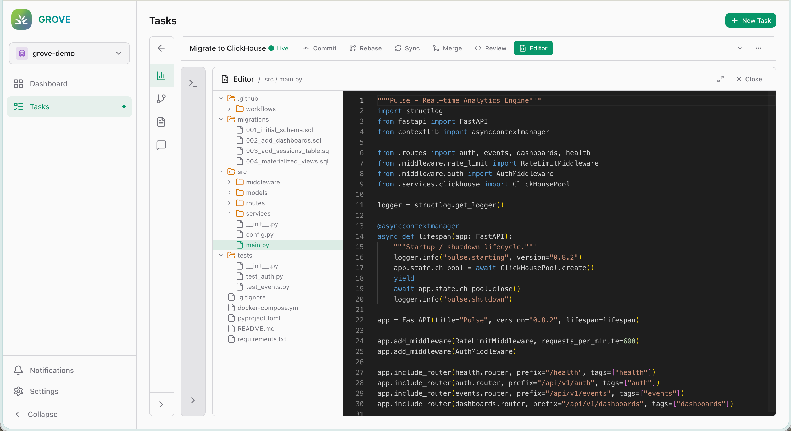 |
| **Integrated Terminal** — Full xterm.js terminal via WebSocket | **Monaco Editor** — In-browser code editing with file tree |
| 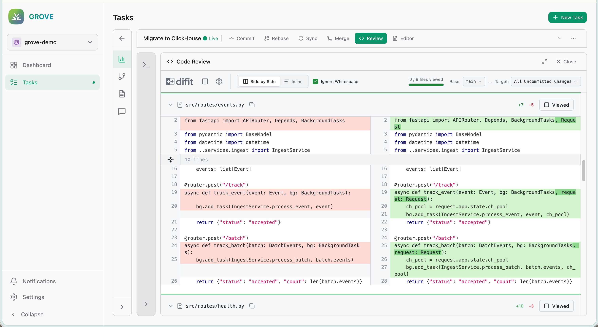 | 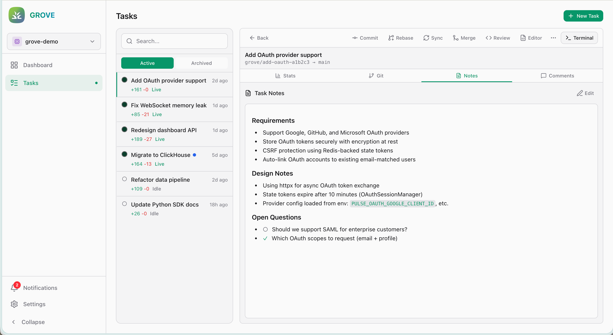 |
| **Code Review** — Diff view with inline review comments | **Task Notes** — Context and requirements per task |
| 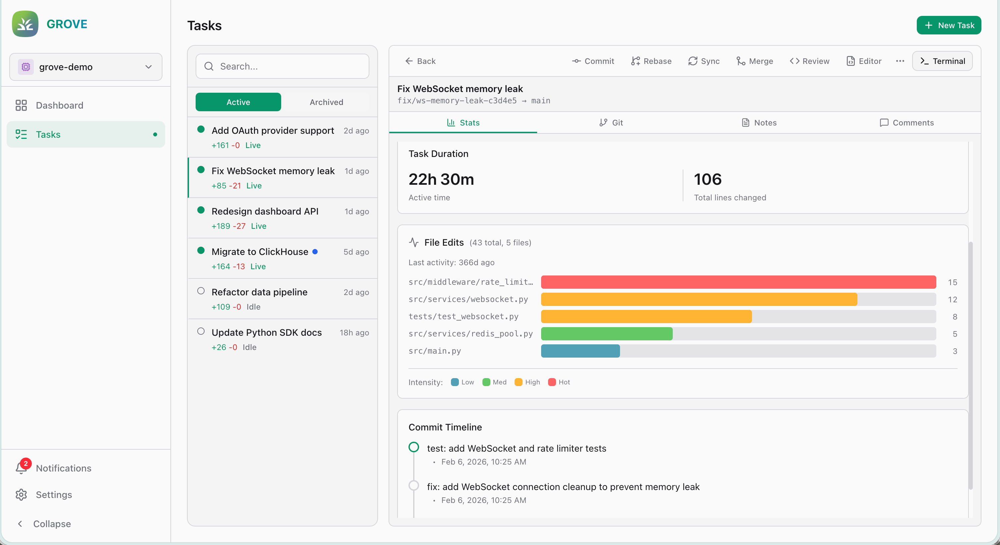 | 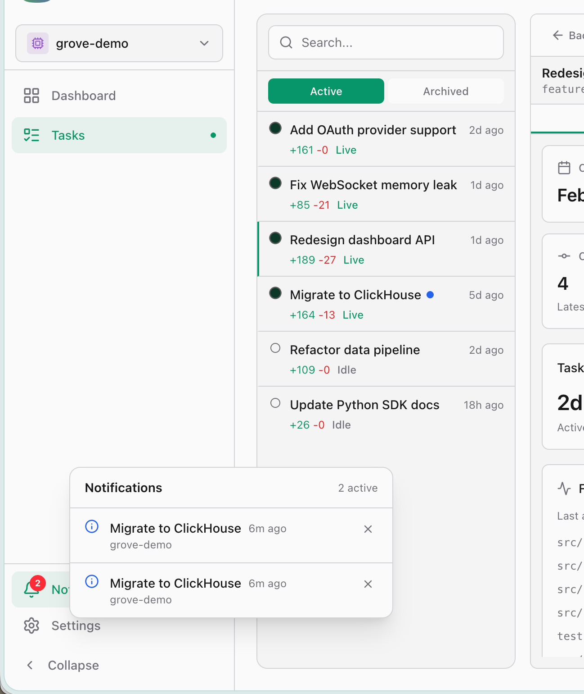 |
| **Activity Stats** — File edit heatmap and timeline | **Hook Notifications** — Real-time agent notification inbox |

```bash
grove web                  # Start server on port 3001
grove web --port 8080      # Custom port
grove web --host 0.0.0.0   # Expose to network
```

### GUI — `grove gui` (macOS)

A native desktop application powered by Tauri 2 WebView. Shares the same frontend as Grove Web, but runs in a native window instead of a browser.

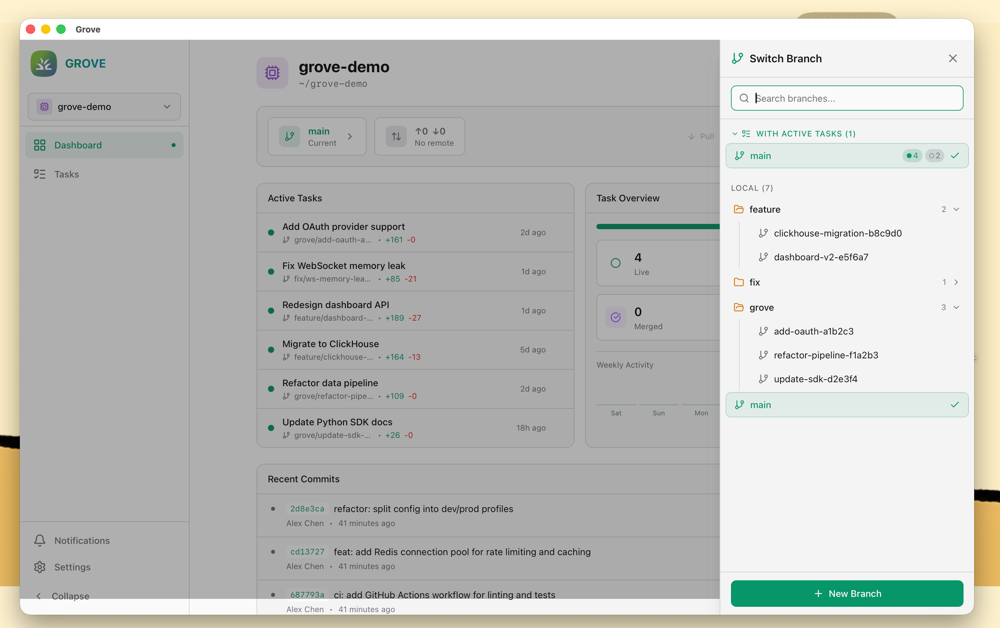

```bash
grove gui              # Launch desktop window
grove gui --port 8080  # Custom API port
```

**Included by default** in macOS release binaries (GitHub Releases / install.sh). For `cargo install`, enable with:

```bash
cargo install grove-rs --features gui
```

---

## Preview Panel

Press `p` to toggle the side panel showing details for the selected task:

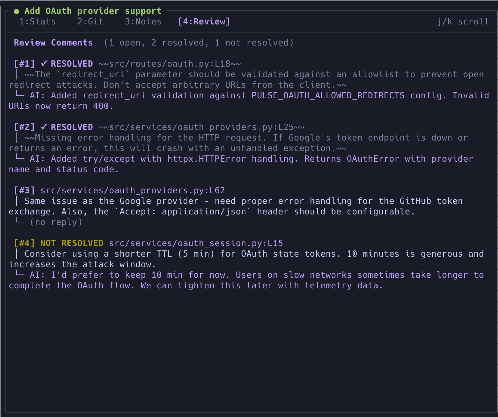

- **Stats** — file edit heatmap and activity timeline
- **Git** — recent commits, diff stats, uncommitted changes
- **Notes** — user-provided context and requirements (editable with `e`)
- **Review** — code review comments from difit

Use `j/k` to scroll panel content, `1/2/3/4` to switch sub-tabs.

---

## Themes

11 built-in themes with auto dark/light detection. Press `t` to switch.

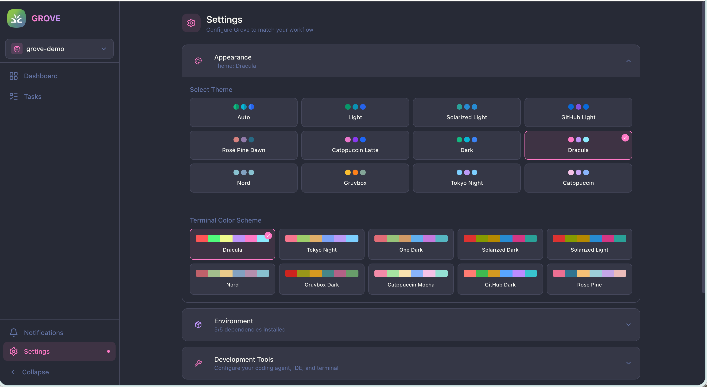

Dracula · Nord · Gruvbox · Tokyo Night · Catppuccin · Catppuccin Latte · Rosé Pine Dawn · Solarized Light · GitHub Light · Light · Dark (default)

---

## Agent Hooks

Let Grove watch your AI agents so you don't have to.

When your AI agent finishes a task, trigger notifications:

```bash
grove hooks notice    # Task completed
grove hooks warn      # Needs attention
grove hooks critical  # Something's wrong
```

Press `h` in Grove to configure sound and notification settings.

## MCP Server

Grove provides a Model Context Protocol (MCP) server for AI agent integration.

Add to your Claude Code MCP config (`~/.claude/config.json`):

```json
{
  "mcpServers": {
    "grove": {
      "command": "grove",
      "args": ["mcp"]
    }
  }
}
```

**Available Tools:**

| Tool | Description |
|------|-------------|
| `grove_status` | Check if running inside a Grove task, get context |
| `grove_read_notes` | Read user-provided task notes |
| `grove_read_review` | Read code review comments with status |
| `grove_reply_review` | Batch reply to review comments |
| `grove_complete_task` | Complete task: commit → rebase → merge → archive |

When inside a Grove task, the agent can read notes, respond to code review feedback, and complete the task with a single tool call.

---

## Requirements

- Git 2.20+
- tmux 3.0+ or Zellij
- macOS 12+ or Linux

## License

MIT
