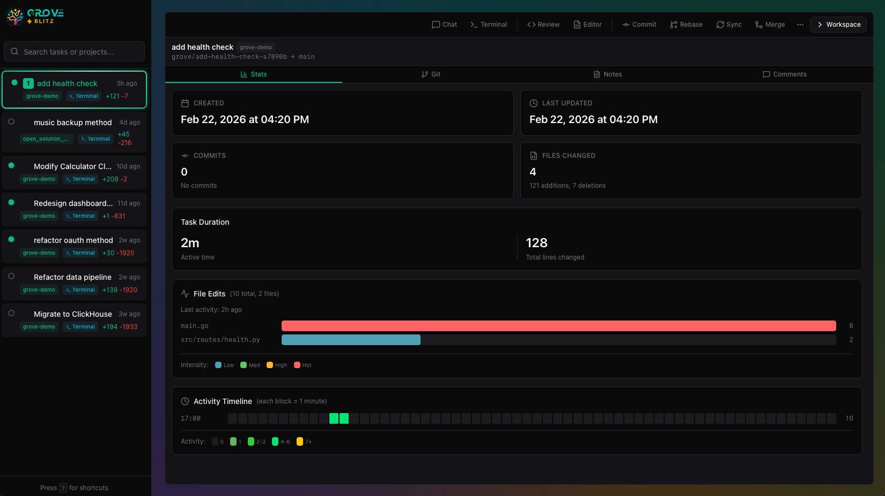
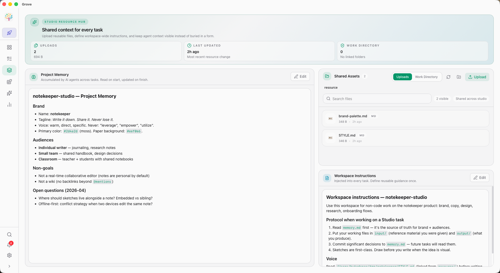
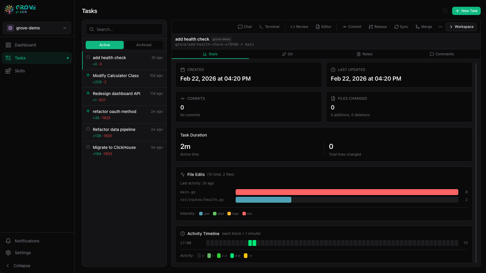

# Grove

### Where humans and AI agents build together.
**AI development, for everyone — not just coders.**

[](https://garrickz2.github.io/grove/)
[](https://crates.io/crates/grove-rs)
[](https://crates.io/crates/grove-rs)
[](https://www.rust-lang.org/)
[](LICENSE)
[]()


Grove is a workspace for you and your AI development team. Write a spec, send a sketch, hold a button and talk — every major coding agent runs in parallel, every change goes through review, every merge is a decision someone made. From your terminal, your browser, your desktop, or your phone.

> Grove treats **Studio** — the space where designers, PMs, and brand folks shape the product alongside AI — as a first-class surface. Code review is rigorous. But the product isn't just "a review tool that also has chat."
>
> And with **Agent Graph**, your AI team is a typed DAG, not a single chat. A planner spawns a coder. The coder spawns a reviewer. Every cross-agent message is structured, logged, and scoped per task.

---

## Quick Start

```bash
# macOS
brew tap GarrickZ2/grove && brew install grove

# Other platforms — see Install section below
```

Pick your surface and run it once inside any directory:

```bash
grove web  # Browser IDE at http://localhost:3001
grove gui  # Native desktop window
grove tui  # Keyboard-first terminal UI
```

After that, `grove` alone resumes whichever mode you last used.

The thing most people miss: every task gets its own Git worktree and tmux session. Not a branch — a full isolated directory. Ten agents can work on ten tasks at the same time and they will never touch the same file. This is the only architecture that makes parallel agents actually safe.

Write a spec in Task Notes. Agents read it through the MCP server before touching code. Pick an agent — Claude Code, Codex, Gemini, Copilot, and nine others are built in. Watch them work in Blitz view: every active task across every registered repo, live, in one place.

When they're done, review the diff. Comment on any line. Select a batch of unresolved comments and let the AI fixer address them all at once — you approve the diff, not each comment. Then: commit → rebase → merge → archive. One action.

Most tools stop there. Grove also tracks tool calls per task, review AI adoption rate, spec length vs. how many times you had to intervene, and an agent leaderboard. Enough signal to figure out what's actually working.

---

## Install

Single binary with the Web IDE embedded. Only Git and a terminal multiplexer on Unix.

### For Humans

Copy and paste this prompt to your LLM agent (Claude Code, Cursor, AmpCode, etc.):

> Install and configure Grove by following the instructions here:
> https://raw.githubusercontent.com/GarrickZ2/grove/master/docs/install.md

Or read the [Installation Guide](docs/install.md) — but seriously, let an agent do it. Humans fat-finger configs.

If you'd rather run a command yourself, pick one:

```bash
# Homebrew
brew tap GarrickZ2/grove && brew install grove

# Shell (macOS / Linux / WSL)
curl -sSL https://raw.githubusercontent.com/GarrickZ2/grove/master/install.sh | sh

# Shell — Linux GUI variant (x86_64)
curl -sSL https://raw.githubusercontent.com/GarrickZ2/grove/master/install.sh | GROVE_GUI=1 sh

# Windows (PowerShell)
irm https://raw.githubusercontent.com/GarrickZ2/grove/master/install.ps1 | iex

# Cargo
cargo install grove-rs                 # TUI + Web + MCP
cargo install grove-rs --features gui  # + native desktop GUI
```

### For LLM Agents

Fetch the installation guide and follow it:

```bash
curl -s https://raw.githubusercontent.com/GarrickZ2/grove/master/docs/install.md
```

Note: the published binary name is `grove`. After install, run `grove` inside any Git repo to launch the Web IDE on `http://localhost:3001`, or `grove gui` for the native desktop window. Project state lives under `~/.grove/` (config, tasks, AI summaries, notes); never edit files there by hand.

**Prebuilt binaries** — macOS `.dmg`, Windows `.exe`, Linux `.tar.gz` / `.AppImage`: [Latest release ↗](https://github.com/GarrickZ2/grove/releases/latest)

> macOS tip — if the `.dmg` won't open ("Grove is damaged / can't be verified"), it's Gatekeeper quarantining an unsigned build. Unblock it with:
>
> ```bash
> xattr -rd com.apple.quarantine /Applications/Grove.app
> ```

**Run:**

```bash
cd your-project
grove          # Smart start — resumes your last mode
grove web      # Browser IDE on http://localhost:3001
grove gui      # Native desktop window (Tauri)
grove mobile   # LAN access for phone / tablet with HMAC auth
grove tui      # Keyboard-first terminal UI
```

---

## What Grove gives you

### 🌿 Ten agents. One workspace. Zero collisions.



The standard approach to running multiple agents is chaos: shared working tree, competing writes, one agent undoing what another just built. Grove solves this at the architecture level. Every task is a dedicated Git worktree on its own branch with its own tmux session — physical isolation, not just logical. Ten agents work on ten tasks simultaneously and will never touch the same file.

**Built-in:** Claude Code · Codex · Gemini CLI · GitHub Copilot · Cursor Agent · Junie · Trae CLI · Kimi · Qwen · OpenCode · Hermes · Kiro · OpenClaw

Plug in any binary that speaks ACP over stdio, or any HTTP endpoint — one entry in `config.toml`.

**Blitz view** shows every active task across every registered repo in one real-time feed. You see all ten agents working at once without switching windows.


---

### 🧠 Agent Graph — structured orchestration, not bash glue



A planner agent spawns a coder with a scoped spec. The coder spawns a reviewer with only the relevant diff. The reviewer's reply routes back through a typed message queue, not a string passed through `$PROMPT`. Grove enforces this at the DB layer: one message in-flight per edge, cycle detection at spawn time, every message a `<grove-meta>` envelope with sender, intent, and task scope.

Six MCP tools make the whole graph programmable from inside any agent: `grove_agent_spawn` · `grove_agent_send` · `grove_agent_reply` · `grove_agent_contacts` · `grove_agent_capability` · `grove_get_spawn_candidates`. A Claude Code orchestrator can create tasks, fill worktrees, and archive branches without a human in the loop.

**Custom Agents (personas):** name a base model + system prompt + effort level. Reuse the same "adversarial reviewer" persona across every task that needs one.

---

### 🎨 Studio — no terminal, no git, still shipping


Studio exists because the people who most need to shape the product are the ones most locked out of AI workflows. Grove doesn't ask designers, PMs, or brand teams to learn git. It gives them a room.

Upload shared assets once — Grove hard-links them into every task's worktree so agents always have the latest without duplication or manual sync. Draw on a real Excalidraw canvas per task; agents read and write sketches via `grove_sketch_read` / `grove_sketch_draw`, turning a rough UI layout into a buildable spec. Edit Project Memory and Workspace Instructions from a UI — no markdown file to find, no CLI to open. Every agent reads them on every task, automatically.

D2 diagrams, Mermaid charts, and HTML previews render live inside the panel as agents produce them.


---

### 🚢 Review that earns the merge


Line-level comment threads. `@`-file mentions with autocomplete. Filter by status and author so your notes don't get lost in the agent's self-review. Select any batch of unresolved comments and run the AI batch fixer — it addresses all of them at once and produces a single diff. You approve the diff. Not each comment.

One action to ship: commit, rebase onto target, merge, archive. Squash-merge detection is automatic. Cross-branch safety is built in.

---

### 🌐 Anywhere — TUI · Web · GUI · Mobile · Voice

Same workspace, five surfaces.

**TUI** — the original. `j`/`k` to navigate tasks, full review workflow, no mouse required.


**Web IDE** — the main event: FlexLayout with 10 panel types, IDE Layout mode with Monaco and a file tree, ⌘K command palette. The **desktop** (Tauri) wraps the same Web IDE in a native window.

`grove mobile` prints a QR code in the terminal. Scan from your phone — every subsequent request is automatically HMAC-SHA256 signed, the secret embedded in the QR. The key never crosses the wire unprotected. Optional TLS, custom bind address, or `--private` for localhost-only.


**Radio:** hold a button on your phone, talk, release. The transcript goes to the right Chat or Terminal — nine configurable slots, each pointed at a different task. You're directing your AI team from your pocket.


---

### 📊 Measure what shipped



Most tools stop at merge. Grove tracks tool calls per task, spec length vs. intervention count, review AI adoption rate and hit rate, average fix cycles per comment, and an agent leaderboard. Enough signal to understand what's actually working — and what's costing you the most intervention.

---

## Who Grove is for

- **Power developers** — Web IDE with FlexLayout, Blitz across projects, 10 agents in parallel, Agent Graph to orchestrate them; TUI when you want it.
- **Visual thinkers** — IDE Layout, Sketch canvases agents can read, click-through reviews, inline D2 / Mermaid.
- **Non-technical collaborators** — Studio to manage assets and memory; Radio to drive AI by voice from a phone. No terminal. No git. Still shipping.

---

## Dig deeper

| | |
|---|---|
| 🌿 **[Agents →](https://garrickz2.github.io/grove/agents.html)**<br>Every coding agent, in parallel. | 🎨 **[Studio →](https://garrickz2.github.io/grove/studio.html)**<br>For everyone on the team. |
| 🌐 **[Anywhere →](https://garrickz2.github.io/grove/anywhere.html)**<br>TUI · Web · GUI · Mobile · Voice. | 🚢 **[Workflow →](https://garrickz2.github.io/grove/workflow.html)**<br>Spec to ship, with rigor. |
| 🧩 **[Extend →](https://garrickz2.github.io/grove/extend.html)**<br>Skills · MCP · Yours. | 📜 **[Capabilities →](docs/capabilities.md)**<br>Full feature reference. |

---

## Requirements

- Git 2.20+
- tmux 3.0+ or Zellij *(not required on Windows)*
- macOS 12+, Linux, or Windows 10/11

**Linux GUI runtime deps** (Debian/Ubuntu):

```bash
sudo apt install libwebkit2gtk-4.1-0 libgtk-3-0 libayatana-appindicator3-1 librsvg2-2
```

## License

MIT
