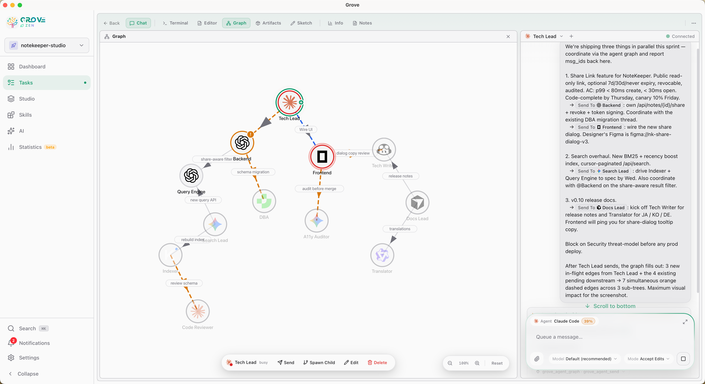

# Grove

**The multi-agent IDE.**
*Run every coding agent you use in one workspace, working in parallel as a team.*

[](https://garrickz2.github.io/grove/)
[](https://crates.io/crates/grove-rs)
[](https://crates.io/crates/grove-rs)
[](https://www.rust-lang.org/)
[](LICENSE)
[]()



Grove is an **ACP-native** workspace for ten built-in coding agents: Claude Code, Codex, Cursor, Gemini, Copilot, Junie, Kimi, OpenCode, Qwen, Trae. Any ACP-over-stdio binary or HTTP endpoint plugs in with one entry.

Two protocols hold it together: **ACP** for connection, **MCP** for action. Every UI action — create a task, send a prompt, read a sketch, reply to a review thread, merge a branch — is also an MCP tool, so any agent can do it through code.

Typical loop:

> Spec in **Studio** → dispatch to **a team of agents** in parallel → watch in **Blitz** → **review** with AI batch-fix → merge.

Surfaces: Web IDE (main), native GUI (Tauri), TUI, mobile (HMAC-paired), voice (Radio walkie-talkie).

---

## Quick start

Let your AI agent install Grove (see [Install](#install) below). Or, if you insist:

```bash
brew tap GarrickZ2/grove && brew install grove   # macOS — Install section covers Linux, Windows, Cargo
```

Then, inside any directory:

```bash
grove        # resumes your last surface
grove web    # browser IDE at http://localhost:3001
grove gui    # native desktop window
grove tui    # terminal UI
```

---

## 1. Studio — for the work that isn't code


Studio is a separate project type for specs, design briefs, brand exploration, prototype layouts. Folder layout: `input/`, `output/`, `resource/`, `sketch/`. No git worktree.

Sketches are Excalidraw canvases with checkpoint history. Agents read and modify them — a layout sketch is something a coder can build against.

Project Memory and Workspace Instructions live in the same UI as markdown, and load into every agent on every task automatically. Shared Assets are hard-linked into dependent Coding Tasks, so reference docs stay in sync without manual copy.

Engineers, designers, and PMs use Studio for the same reason: the work isn't code.


---

## 2. A team of agents, in parallel

Ten coding agents are built in: Claude Code, Codex, Cursor, Gemini, Copilot, Junie, Kimi, OpenCode, Qwen, Trae. Add any ACP agent from the Add Agent dialog. Define **Custom Agents** as personas — a base model, system prompt, and effort level reusable across tasks (e.g. "adversarial reviewer", "doc writer", "test-first coder").

Each task runs in an isolated working context, so ten agents can work on ten tasks without collision. **Blitz view** streams every active task across every registered project in real time.

### Agent Graph — agents that orchestrate agents


An orchestrator agent spawns a coder. The coder spawns a reviewer. Replies route back as typed messages, not strings glued through prompts. Cycles are caught at spawn, every message is scoped to a task and logged, one message in flight per edge. Enforced at the database layer, not by convention.

---

## 3. Code review with an AI batch fixer


Line-level threaded comments. `@`-file mentions with autocomplete. Filter by status, author, or resolved-by-agent, so human and agent comments stay separated.

Select any batch of unresolved comments and run the **AI batch fixer**: one diff addresses all of them. You approve the diff, not each comment.

Agents can also review each other's diffs.

---

## 4. Anywhere — Web, GUI, TUI, Mobile, Voice

Same workspace, five surfaces.


- **Web IDE** — main surface: FlexLayout, 10 panel types, Monaco-based IDE Layout, ⌘K palette, live D2 / Mermaid / HTML preview.
- **Native GUI** (Tauri) — same Web IDE in a native window, with system tray and OS notifications.
- **TUI** — keyboard-only, `j`/`k` navigation, full review workflow.
- **Mobile** — `grove mobile` prints a QR. Scan from your phone; every request is HMAC-SHA256 signed with the secret embedded in the QR. Optional TLS, custom bind address, `--private` for localhost-only.
- **Radio** — hold-to-talk from your phone. The transcript routes to a configured Chat or Terminal slot; nine slots, each bound to a different task.


---

## Install

Single binary. Web IDE embedded. Requires Git and a terminal multiplexer (tmux or Zellij) on Unix.

### For humans

Don't read install docs. Paste this into your AI agent (Claude Code, Cursor, Codex CLI, AmpCode — any of them):

> Install and configure Grove by following the instructions here:
> https://raw.githubusercontent.com/GarrickZ2/grove/master/docs/install.md

The agent handles the Homebrew tap, the shell installer, PATH wiring, and platform-specific quirks.

If you prefer to type a command yourself:

```bash
# Homebrew (macOS)
brew tap GarrickZ2/grove && brew install grove

# Shell installer (macOS / Linux / WSL)
curl -sSL https://raw.githubusercontent.com/GarrickZ2/grove/master/install.sh | sh

# Shell installer — Linux with GUI (x86_64)
curl -sSL https://raw.githubusercontent.com/GarrickZ2/grove/master/install.sh | GROVE_GUI=1 sh

# PowerShell (Windows)
irm https://raw.githubusercontent.com/GarrickZ2/grove/master/install.ps1 | iex

# Cargo
cargo install grove-rs                 # TUI + Web + MCP
cargo install grove-rs --features gui  # + native desktop GUI
```

**Prebuilt binaries** (`.dmg` / `.exe` / `.AppImage` / `.tar.gz`): [latest release](https://github.com/GarrickZ2/grove/releases/latest).

> **macOS tip** — if the `.dmg` won't open ("Grove is damaged"), it's Gatekeeper quarantine on an unsigned build:
> ```bash
> xattr -rd com.apple.quarantine /Applications/Grove.app
> ```

### For agents

LLM agent reading this README and asked to install Grove — fetch the canonical install guide and follow it:

```bash
curl -s https://raw.githubusercontent.com/GarrickZ2/grove/master/docs/install.md
```

The guide covers OS detection, package-manager choice, PATH setup, and post-install verification. State lives under `~/.grove/` (config, tasks, AI artifacts, notes, SQLite) — never edit by hand.

---

## Requirements

- Git 2.20+
- tmux 3.0+ or Zellij *(not required on Windows)*
- macOS 12+, Linux, or Windows 10/11

**Linux GUI runtime deps** (Debian/Ubuntu):

```bash
sudo apt install libwebkit2gtk-4.1-0 libgtk-3-0 libayatana-appindicator3-1 librsvg2-2
```

---

## Dig deeper

| | |
|---|---|
| **[Agents →](https://garrickz2.github.io/grove/agents.html)**<br>Every coding agent, in parallel. | **[Agent Graph →](https://garrickz2.github.io/grove/extend.html)**<br>Typed DAG, agent-to-agent messaging. |
| **[Studio →](https://garrickz2.github.io/grove/studio.html)**<br>Sketch, memory, assets. | **[Workflow →](https://garrickz2.github.io/grove/workflow.html)**<br>Spec to ship. |
| **[Anywhere →](https://garrickz2.github.io/grove/anywhere.html)**<br>TUI · Web · GUI · Mobile · Voice. | **[Statistics →](https://garrickz2.github.io/grove/workflow.html#stats)**<br>Token use, agent leaderboard. |
| **[Capabilities →](docs/capabilities.md)**<br>Full feature reference. | **[Install →](docs/install.md)**<br>Detailed setup. |

---

## License

MIT
